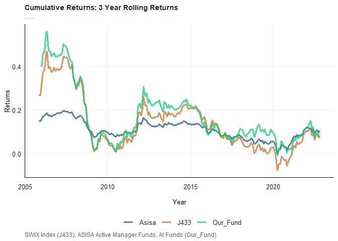
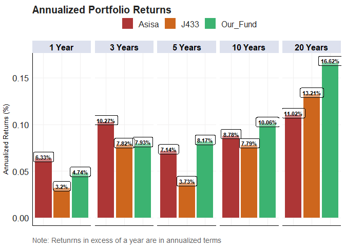
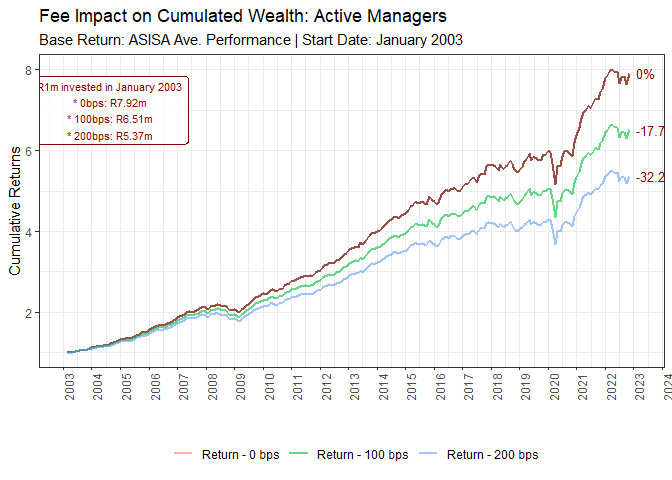
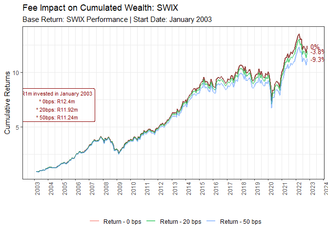
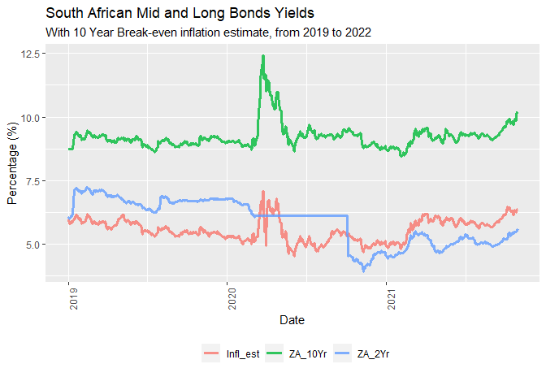
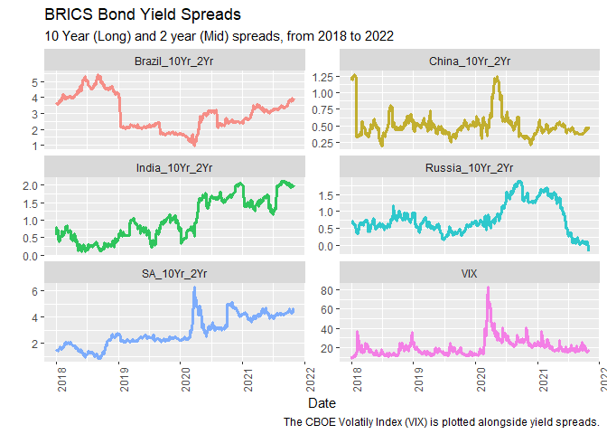

# Purpose

Purpose of this work folder.

Ideally store a minimum working example data set in data folder.

Add binary files in bin, and closed R functions in code. Human Readable
settings files (e.g. csv) should be placed in settings

``` r
rm(list = ls()) # Clean your environment:
gc() # garbage collection - It can be useful to call gc after a large object has been removed, as this may prompt R to return memory to the operating system.
```

    ##          used (Mb) gc trigger (Mb) max used (Mb)
    ## Ncells 454926 24.3     977685 52.3   644205 34.5
    ## Vcells 825568  6.3    8388608 64.0  1635495 12.5

``` r
library(tidyverse)
```

    ## ── Attaching packages ─────────────────────────────────────── tidyverse 1.3.1 ──

    ## ✔ ggplot2 3.3.6     ✔ purrr   0.3.4
    ## ✔ tibble  3.1.7     ✔ dplyr   1.0.9
    ## ✔ tidyr   1.2.0     ✔ stringr 1.4.0
    ## ✔ readr   2.1.2     ✔ forcats 0.5.1

    ## ── Conflicts ────────────────────────────────────────── tidyverse_conflicts() ──
    ## ✖ dplyr::filter() masks stats::filter()
    ## ✖ dplyr::lag()    masks stats::lag()

``` r
list.files('code/', full.names = T, recursive = T) %>% .[grepl('.R', .)] %>% as.list() %>% walk(~source(.))
```

# How to get started

``` r
# eval=F and echo=T, as i want to see the code but I don't want it to run again

# create a project
fmxdat::make_project(Open = T)
# location: C:\Masters Economics\Fin Metrics\Fin_Metrics_Prac_Exam_2022\Fin_Metrics_Prac_Exam_2022
# from the clipboard

# create folders for each Question
# create folders for each Question
Texevier::create_template(
    directory = "C:/Masters Economics/Fin Metrics/Fin_Metrics_Prac_Exam_2022/Fin_Metrics_Prac_Exam_2022",
            template_name = "Question1", build_project = TRUE, open_project = FALSE)
# create folders for each Question
Texevier::create_template(
    directory = "C:/Masters Economics/Fin Metrics/Fin_Metrics_Prac_Exam_2022/Fin_Metrics_Prac_Exam_2022",
            template_name = "Question2", build_project = TRUE, open_project = FALSE)# create folders for each Question
Texevier::create_template(
    directory = "C:/Masters Economics/Fin Metrics/Fin_Metrics_Prac_Exam_2022/Fin_Metrics_Prac_Exam_2022",
            template_name = "Question3", build_project = TRUE, open_project = FALSE)# create folders for each Question
Texevier::create_template(
    directory = "C:/Masters Economics/Fin Metrics/Fin_Metrics_Prac_Exam_2022/Fin_Metrics_Prac_Exam_2022",
            template_name = "Question4", build_project = TRUE, open_project = FALSE)# create folders for each Question
Texevier::create_template(
    directory = "C:/Masters Economics/Fin Metrics/Fin_Metrics_Prac_Exam_2022/Fin_Metrics_Prac_Exam_2022",
            template_name = "Question5", build_project = TRUE, open_project = FALSE)# create folders for each Question
Texevier::create_template(
    directory = "C:/Masters Economics/Fin Metrics/Fin_Metrics_Prac_Exam_2022/Fin_Metrics_Prac_Exam_2022",
            template_name = "Question6", build_project = TRUE, open_project = FALSE)# create folders for each Question
Texevier::create_template(
    directory = "C:/Masters Economics/Fin Metrics/Fin_Metrics_Prac_Exam_2022/Fin_Metrics_Prac_Exam_2022",
            template_name = "Question7", build_project = TRUE, open_project = FALSE)
```

# Question 1: Systematic AI Fund

``` r
library(tidyverse)
ASISA <- read_rds("data/ASISA.rds")
BM <- read_rds("data/Capped_SWIX.rds")
AI_Fund <- read_rds("data/AI_Max_Fund.rds")
```

I begin by addressing the missing values in the ASISA data. I make use
of the ‘q1_impute_missing_values’ from the practicals to address the
missing values using the ‘Drawn_Distribution_Collective’ method as some
Funds have no data at all and therefore values are imputed from the
distribution of all ASISA Funds data. This has the benefit of imputing
values that will conform to performance that is tied to the state of the
economy.

I then calculate monthly average returns for ASISA Funds so to make them
comparable with the other returns data.

``` r
return_mat_Quick = ASISA %>%  
    mutate(Return = Returns) %>% 
    select(date, Name, Return) %>% 
   # filter(date > lubridate::ymd(20080101)) %>% 
    spread(Name, Return)

# need date column for impute_missing_returns
ASISA_imputed_data <- impute_missing_returns(return_mat = return_mat_Quick,
                     impute_returns_method = "Drawn_Distribution_Collective")


# Calc montly average returns for ASISA Funds

ASISA <- ASISA_imputed_data %>% gather(Name, Return, -date) %>% 
    arrange(date) %>%
    group_by(date) %>%
    mutate(Asisa = mean(Return)) %>% # Name ave returns Asisa for left_join
    select(date, Asisa) %>% 
    unique()
```

I combine the data with ‘left_join’, make it tidy and use ‘slice’ to
remove NAs, therefore each data set has the same start date for the
analysis.

``` r
# this works if calc individually firms
q1_data_combined <- left_join(ASISA,
                              
                            AI_Fund %>%  spread(Tickers, Returns),
                                by = "date") %>% 
    
                    left_join(.,
                            BM %>%  spread(Tickers, Returns),
                                by = "date" ) %>% 
                    gather(Tickers, ret, -date) %>% 
                    arrange(date) %>% 
                    ungroup() %>% 
                    slice(-2,-5)
                     # to remove NAs and therefore each data set has the same start date
```

## Rolling 3 Year Annualized Returns

I then make use of a function I created for homework to calculate the 3
year annualized rolling returns for the ASISA average actively managed
fund, the SWIX Index (J433) and the systematic AI fund.

From the graph below, the average actively managed fund has been
outperformed by the SWIX index and by the AI fund. And while this
rolling returns is useful for evaluating and comparing the performance
of different indices, it can be a misleading figure as early
outperformance can greatly skew later performance.

``` r
q1_rolling_returns_func(df_data = plotdf_roll,
                     title = "Cumulative Returns: 3 Year Rolling Returns ",
                     subtitle = "From 2002 to 2022",
                     caption = "SWIX Index (J433), ASISA Active Manager Funds, AI Funds (Our_Fund)",
                     xlabel = "Year",
                     ylabel = "Returns")
```



## Annualized Returns

I then use some of some code from class and append the code to display
the annualized returns for each portfolio at different year intervals.

As can be seen from the graph below historically the SWIX and AI fund
have performed better than the average active manager over the long
term. However, over the last 3 years fund active fund managers have
outperformed the more passive funds.

``` r
q1.1_annualized_return_table(df_data = q1_data_combined,
                                title = "Annualized Portfolio Returns",
                                caption = "Note: Retunrns in excess of a year are in annualized terms",
                                xlabel = "",
                                ylabel = "Annualized Returns (%)")
```



## Performance of Funds Less Fees

I then make use of some code from the practical to demonstrate what
happens to cumulative returns over for different scales of management
fees that are applicable to the particular investment portfolio. I add a
baseline of cumulative returns without fees charged (0%).

The graphs below show how cumulative returns are effected over time by
fees. Actively managed fees are the highest and decrease returns by at
least 17,7% since January 2003. Passively managed funds such as SWIX and
AI fund decrease substantially less over the same period when compared
to active managers. Passively managed investments decreased by at least
3.8% since January 2003. It can be the case that active managers
outperform passive managers, however, when adjusted for fees the average
active manager underperforms compared to passive bench like the SWIX.

``` r
Cum_Fee_Comparison_1.1(Asisa_funds, Fee = 0, Start = ymd(20030101),
                   # Added purely for figure adjustment:
                   Gap = 3, Lvlset = 7,
                   mnthfwd = 18)
```



``` r
#Impact from inception (2002)
Cum_Fee_Comparison_1.2(AI_funds, Fee = 0*1e-4, Start = ymd(20030101),
                   # Added purely for figure adjustment:
                   Gap = 3, Lvlset = 7,
                   mnthfwd = 18)
```


``` r
Cum_Fee_Comparison_1.3(SWIX_funds, Fee = 0, Start = ymd(20030101),
                       # Added purely for figure adjustment:
                       Gap = 3, Lvlset = 7,
                       mnthfwd = 18)
```



# Question 2: Yield Spread 

Economists have recently pointed out that the current yield spreads in
local mid to longer dated bond yields have since 2020 been the highest
in decades.

## Load the data

``` r
library(tidyverse)
SA_bonds <- read_rds("data/SA_Bonds.rds")
BE_Infl <- read_rds("data/BE_Infl.rds")
bonds_2y <- read_rds("data/bonds_2y.rds")
bonds_10y <- read_rds("data/bonds_10y.rds")
usdzar <- read_rds("data/usdzar.rds")
ZA_Infl <- read_rds("data/ZA_Infl.rds")
IV <- read_rds("data/IV.rds")
```

## South African Bond Yields

I begin by viewing the data and determine if there are any missing
values. I then plot the yields for bonds of differing maturities to
visualize the spread between the 3 Month, 2 year and 10 Year South
African bonds.

From the graph below, it does appear that the yield spreads in local mid
to longer dated bond yields have have increased since 2020 when compare
to historical spreads. The yield on the 3 year bond has decreased since
2015, this may be a reflection of anticipated interest rate cuts in the
near future. An increase in interest rates would imply an increase in
bond prices and thus yields would decrease.

``` r
# colSums(is.na(sa_bonds_tidy))
# there are no missing values or NA's

graph_q2.1_func(df_data = df_q2.1_data,
                title = "South African Bond Yields",
                subtitle = "From 2000 to 2022",
                caption = "",
                xlabel = "Date",
                ylabel = "Yield")
```


To further investigate this topic I combine the available data for this
question using ‘left_join’. I make use of this combined data set to
perform the rest analysis.

``` r
q2_data_combined <- left_join(
        # JOIN us DATA
        bonds_10y %>% group_by(Name) %>% filter(Name == "US_10Yr") %>% ungroup() %>% select(-Name),
        bonds_2y %>% group_by(Name) %>% filter(Name == "US_2yr") %>% ungroup() %>% select(-Name),
        by = "date") %>%
    
        # JOIN SA DATA
        left_join(.,
                  SA_bonds %>% select(-SA_3M),
                  by = "date") %>%
        # JOIN THE VIX
        left_join(.,
                  IV %>% mutate(VIX = Price) %>% group_by(Name) %>% filter(Name == "VIX")
                  %>% ungroup() %>% select(-Name, -Price),
                  by = "date") %>%

        # JOIN US ZAR Exchnage Rate
        left_join(.,
                  usdzar %>% mutate(USDZAR = Price) %>% ungroup() %>% select(-Name, -Price),
                  by = "date") %>%

        # JOIN THE inflation data
        left_join(.,
                  BE_Infl %>% mutate(Infl_est = Price) %>% ungroup() %>% select(-Name, -Price),
                  by = "date")
```

Using the combined data set, I plot out the the yields on mid and long
term South African Bonds from 2019 to 2022 to get an idea how the
spreads have changed since the pandemic.

The graph below illustrates how bond how mid and long term bond yields
have adjusted after the COVID-19 pandemic. It is not surprising that 2
year bond yields are down considerably since the pandemic first hit,
this may be the result of investors anticipating monetary easing through
lowered interest rates to combat the economic downturn of the pandemic.
This can be seen with sharp dive on the 2 year bond late in 2020. Since
then, the monetary authorities have been concerned with rising inflation
and so interest rate hikes have been taking place, which explains the
increases in the 2 year yields since late 2020.

``` r
graph_q2.3_func(df_data = df_q2.3_data,
                title = "South African Mid and Long Bonds Yields",
                subtitle = "With 10 Year Break-even inflation estimate, from 2019 to 2022",
                caption = "",
                xlabel = "Date",
                ylabel = "Percentage (%)")
```



## Domestic and Foreign Yields

I construct line graph and use ‘facet_wrap’ to display each variable on
its own axis. The graph shows the the mid to long term yield spread for
both South Africa and the United States over time, as well as the
prevailing interest rate at the time.

Over the past 5 years in both the local South African Bonds market and
the US Bonds Market, the mid to long term yield spread has widen for
both countries. However, as the RSA bond spread is larger it appears
that capital is flowing into South Africa to invest

``` r
graph_q2.2_func(df_data = df_q2.2_data,
                title = "US and ZAR Bond Yield Spreads",
                subtitle = "10 Year (Long) and 2 year (Mid) spreads, from 2018 to 2022",
                caption = "The US Dollar RSA Rand exchange rate is plotted alongside yield spreads.",
                xlabel = "Date",
                ylabel = "")
```


``` r
# to deetermine which countries are included in the data.
#bonds_10y %>% select(Name) %>% unique()
#bonds_2y %>% select(Name) %>% unique()
```

I then plot the the 10 and 2 year yield spread of BRICS Countries along
with the VIX. I do this by calculating spreads for each country and then
select for these spread for the combined data set. The CBOE Volatility
Index has been added to the plot to provide of how yield spreads between
mid and long term bonds for the BRICS countries are increasing as
volatility expectations increase.

From the graph it appears that that there is a positive relationship
between volatility in the equities market implied by the VIX (when
looking at the VIX spike in early 2020) and the bond yield spreads.
Additionally, it appears that the yield spread between the more
developing BRICS countries (Brazil, India, South Africa) experiences a
widening of the yield spread since the beginning of the pandemic.

``` r
graph_q2.4_func(df_data = df_q2.4_data,
                title = "BRICS Bond Yield Spreads",
                subtitle = "10 Year (Long) and 2 year (Mid) spreads, from 2018 to 2022",
                caption = "The CBOE Volatily Index (VIX) is plotted alongside yield spreads.",
                xlabel = "Date",
                ylabel = "")
```



# Question3: Portfolio Construction

``` r
#Load Packages
pacman::p_load("tidyr", "tbl2xts","devtools","lubridate", "readr", "PerformanceAnalytics", "ggplot2", "dplyr")

# load data, and see how this can be stored and later called from your 'data' folder
library(tidyverse)
T40 <- read_rds("data/T40.rds")
RebDays <- read_rds("data/Rebalance_days.rds")
```

## Introduction

Using the information on the ALSI (J200) and SWIX (J400) top 40 Indexes,
this report offers a brief discussion on methodologies of SWIX and ALSI
indexes by looking at the performance of difference explained differing
sector exposure.

## The Data

I make use of the function from the practical to impute missing returns,
if any, in the data.

``` r
#Using the impute_missing_returns function replace the NA with values from the same distribution in the retunrs column
new_data_T40 <- impute_missing_returns(return_mat = T40 %>%
            select(date, Tickers, Return) %>%
            filter(date > lubridate::ymd(20080101)) %>% 
            spread(Tickers, Return),
            impute_returns_method = "Average") %>% 
            gather(Tickers, Return, -date)


T40_imputed <- left_join(T40 %>% select(-Return) %>%
                arrange(date) %>% group_by(Tickers),new_data_T40,
                            by = c("date", "Tickers"))

# neaten the data
T40_imputed$Tickers <- gsub("SJ|Equity", "", T40_imputed$Tickers)
```

Here I reply on the courses practical notes. I begin by creating the
index returns using this capped weight estimator using the tbl2xts
framework. Begin by plotting the cumulative returns for each index.

``` r
graph_q3.1_func(df_data = T40_imputed,
                title = "Cumulative Returns of ALSI and SWIX Weighted Indexes",
                subtitle = "From 2008 to 2022",
                caption = "ALSI (J200) and SWIX (J400) top 40 Indexes",
                xlabel = "Date",
                ylabel = "Percentage %")
```


## Stratification of Indexes

Next, I Break down cumulative returns by industry to get a better idea
of reasons for different performance. I begin with the financials. From
the graph below it appears that the SWIX weights financials more heavily
than the ALSI and therefore outperforms the ALSI.

``` r
graph_q3.2_func(df_data = T40_imputed,
                title = "Cumulative Returns of ALSI and SWIX: Financials Sector",
                subtitle = "From 2008 to 2022",
                caption = "ALSI (J200) and SWIX (J400) top 40 Indexes",
                xlabel = "Date",
                ylabel = "Percentage %")
```


It appears that both indexes weight industrials similarly in their
portfolios.

``` r
graph_q3.3_func(df_data = T40_imputed,
                title = "Cumulative Returns of ALSI and SWIX: Industrials Sector",
                subtitle = "From 2008 to 2022",
                caption = "ALSI (J200) and SWIX (J400) top 40 Indexes",
                xlabel = "Date",
                ylabel = "Percentage %")
```


From the graph below, it appears that the ALSI weights resources more
heavily than the SWIX and therefore outperforms the SWIX.

``` r
graph_q3.4_func(df_data = T40_imputed,
                title = "Cumulative Returns of ALSI and SWIX: Resources Sector",
                subtitle = "From 2008 to 2022",
                caption = "ALSI (J200) and SWIX (J400) top 40 Indexes",
                xlabel = "Date",
                ylabel = "Percentage %")
```


To determine the weights per sector for each index. I select the Top 40
stocks per date and then re-scale the weight to add to 1 at each date. I
then group and summarise the weights by sector.

I one can see from the Portfolio Weights graphs below both indexes
allocate a substantial amount to industrials. However, performance
differences between the two indexes can be explained by the differences
in weights between financials and resources.

``` r
weights_graph_q3.6_func(df_data = rebalance_col_J200,
                title = "Portfolio Weights of the ALSI Index by Sector",
                subtitle = "From 2008 to 2022",
                caption = "ALSI (J200) Top 40 Indexes",
                xlabel = "Date",
                ylabel = "Weight")
```


``` r
weights_graph_q3.7_func(df_data = rebalance_col_J200,
                title = "Portfolio Weights of the SWIX Index by Sector",
                subtitle = "From 2008 to 2022",
                caption = "SWIX (J400) Top 40 Indexes",
                xlabel = "Date",
                ylabel = "Weight")
```


## Capping Indexes

The impact different capping levels would on both the SWIX and ALSI (6%
and 10%), is that the ALSI(J200) outperforms the SWIX by an slightly
greater margin than before the capping. This may be due higher weights
of financial equities which have performed well recently.

``` r
cum_returns_q3.5_func(df_data = RebDays,
                    title = "Cumulative Returns of Capped Weighted Indexes",
                      subtitle = "ALSI (10%) and SWIX (6%), from 2008 to 2022",
                      caption = "ALSI (J200) and SWIX (J400) top 40 Indexes",
                      xlabel = "Date",
                      ylabel = "Percentage %")  
```


# Question 5: Volatility and GARCH estimates

``` r
library(tidyverse)
library(urca)
library(rugarch)
```

    ## Warning: package 'rugarch' was built under R version 4.2.2

    ## Loading required package: parallel

    ## 
    ## Attaching package: 'rugarch'

    ## The following object is masked from 'package:purrr':
    ## 
    ##     reduce

    ## The following object is masked from 'package:stats':
    ## 
    ##     sigma

``` r
library(tbl2xts)

# read in the data, and see how this can be stored and later called from your 'data' folder.
cncy <- read_rds("data/currencies.rds")
cncy_Carry <- read_rds("data/cncy_Carry.rds")
cncy_value <- read_rds("data/cncy_value.rds")
cncyIV <- read_rds("data/cncyIV.rds")
bbdxy <- read_rds("data/bbdxy.rds")
```

## Introduction

The South African Rand (ZAR) over the past few years has been label one
of the most volatile currencies. This report seeks to investigate this
claim.

## Volatility of the South African Rand

Making use of the Currency Implied Volatility data, I arrange the
currencies in descending order of average implied volatility from 1933
to 2021. Implied volatility is constructed using both option premiums to
gauge the market foresees higher future volatility for a currency. From
the table below one can see that the South African Rand has the largest
average implied volatility from the sample of all countries. The table
displays the 10 currencies with the highest average implied volatility.

``` r
# Table of 20 most volatile stocks according to average volatility over 
Q5.1_vol_table_func(df_data = df_q5.1_cncyIV_data)
```

| Name        | Value |
|:------------|------:|
| SouthAfrica | 16.30 |
| Brazil      | 15.12 |
| Hungary     | 12.89 |
| Turkey      | 12.87 |
| Poland      | 12.58 |
| Columbia    | 12.25 |
| Russia      | 12.21 |
| NZ          | 11.98 |
| Mexico      | 11.49 |
| Norway      | 11.37 |

Implied Volatility

Averages may be misleading, therefore I plot the the implied volatility
of the top 5 most volatile currencies to get a sense of if the Rand has
been consistently been the most volatile or the average is high because
of historically high period with in the full data set.

From the graph below it appears that the Rand experienced large price
swings in the early 2000’s compared to its counter parts, but since then
has had relatively similar performance to the other plotted currencies.

``` r
Q5.1_graph_func_vol(df_data = df_q5.1_cncyIV_graph_data,
                    title = "Currency Implied Volatility per Country",
                    subtitle = "Top 5 Most Volatile",
                    caption = "Data Source:",
                    xlabel = "Year",
                    ylabel = "Implied Volatility")
```


I therefore reduce the sample period to the last 5 years in order to
determine if currency has been one of the most volatile in recent years.
Below display a table of the currency implied volatility data set from
2016 to 2021 and arrange the currencies in descending order of average
implied volatility.

``` r
Q5.2_vol_table_func(df_data = df_q5.1_cncyIV_data)
```

| Name        | Value |
|:------------|------:|
| Turkey      | 16.54 |
| SouthAfrica | 15.93 |
| Brazil      | 15.67 |
| Columbia    | 13.12 |
| Mexico      | 13.06 |
| Russia      | 12.30 |
| Chile       | 10.98 |
| Norway      |  9.89 |
| Hungary     |  9.20 |
| NZ          |  9.11 |

Implied Volatility

From both tables and graph, the South African Rand appears to be the
most volatile according to how the market foresees the Rand will behave.

## GARCH estimates

The question therefore becomes how much of the Rand’s volatility is
actually volatility related to the information and market forces at a
particular time and not on the momentum of previous periods of
volatility momentum from previous periods, given that periods of
volatility tends to cluster and may not give an accurate measure of
volatility at that point in time due this persistence.

I therefore make use of a GARCH model to calculate volatility estimates
by decomposing the residuals of currency into its structural volatility
estimates and noise.

I begin by testing the for stationary and find as expected the
Rand-Dollar exchange rate is non stationary, as the absolute value of
the test statistic does not exceed the absolute value of the critical
value.

``` r
price <- cncy %>% 
            filter(Name == "SouthAfrica_Cncy") %>% 
             pull(Price)

library(urca)
summary(ur.df(price, type="none", lags = 1, selectlags = c("BIC")))
```

    ## 
    ## ############################################### 
    ## # Augmented Dickey-Fuller Test Unit Root Test # 
    ## ############################################### 
    ## 
    ## Test regression none 
    ## 
    ## 
    ## Call:
    ## lm(formula = z.diff ~ z.lag.1 - 1 + z.diff.lag)
    ## 
    ## Residuals:
    ##      Min       1Q   Median       3Q      Max 
    ## -0.78612 -0.03347 -0.00043  0.03007  1.52714 
    ## 
    ## Coefficients:
    ##              Estimate Std. Error t value Pr(>|t|)
    ## z.lag.1     0.0001139  0.0001171   0.972    0.331
    ## z.diff.lag -0.0074499  0.0109781  -0.679    0.497
    ## 
    ## Residual standard error: 0.09566 on 8301 degrees of freedom
    ## Multiple R-squared:  0.0001661,  Adjusted R-squared:  -7.482e-05 
    ## F-statistic: 0.6894 on 2 and 8301 DF,  p-value: 0.5019
    ## 
    ## 
    ## Value of test-statistic is: 0.9723 
    ## 
    ## Critical values for test statistics: 
    ##       1pct  5pct 10pct
    ## tau1 -2.58 -1.95 -1.62

I make use of the Rand-Dollar exchange rate begin by wrangling, scale
and calculating the log first differences of the Rand data to make the
data stationary so I can make can accurately determine GARCH estimates.

I then test for stationary again and find as expected the transformed
Rand-Dollar exchange rate stationary, as the absolute value of the test
statistic does exceed the absolute value of the critical value.
Therefore, the errors are now white noise.

``` r
log_diff_price <- cncy %>% 
                    group_by(Name) %>% 
                    filter(Name == "SouthAfrica_Cncy") %>% 
                    mutate(dlogret = log(Price) - log(lag(Price))) %>% 
                    mutate(scaledret = (dlogret - mean(dlogret, na.rm = T))) %>% 
                    filter(date > first(date)) %>% 
                        ungroup() %>% pull(scaledret)

library(urca)
summary(ur.df(log_diff_price, type="none", lags = 1, selectlags = c("BIC"))) 
```

    ## 
    ## ############################################### 
    ## # Augmented Dickey-Fuller Test Unit Root Test # 
    ## ############################################### 
    ## 
    ## Test regression none 
    ## 
    ## 
    ## Call:
    ## lm(formula = z.diff ~ z.lag.1 - 1 + z.diff.lag)
    ## 
    ## Residuals:
    ##       Min        1Q    Median        3Q       Max 
    ## -0.066516 -0.004618 -0.000208  0.004098  0.153965 
    ## 
    ## Coefficients:
    ##            Estimate Std. Error t value Pr(>|t|)    
    ## z.lag.1    -1.03747    0.01564 -66.324   <2e-16 ***
    ## z.diff.lag  0.02124    0.01097   1.935    0.053 .  
    ## ---
    ## Signif. codes:  0 '***' 0.001 '**' 0.01 '*' 0.05 '.' 0.1 ' ' 1
    ## 
    ## Residual standard error: 0.009462 on 8300 degrees of freedom
    ## Multiple R-squared:  0.5082, Adjusted R-squared:  0.508 
    ## F-statistic:  4288 on 2 and 8300 DF,  p-value: < 2.2e-16
    ## 
    ## 
    ## Value of test-statistic is: -66.3237 
    ## 
    ## Critical values for test statistics: 
    ##       1pct  5pct 10pct
    ## tau1 -2.58 -1.95 -1.62

I amend some code from the practicals and nested it within a graphing
function to render a comparison between the currency returns sigma,
which contains noise and is plotted on the graph in black, and the noise
reduced Sigma estimate from the GARCH model plotted in red. Therefore,
the volatility of the Rand maybe be overstated before controlling for
noise.

``` r
q5_GARCH_Graph(df_data = cncy,
               title = "Comparison: Currency Returns Sigma vs Sigma from Garch",
               subtitle = "USD Dollar to Rand Exchange Rate",
               caption = "Red line - noise reduced actual volatility
               Black line = Red line + Noise",
               xlabel = "",
               ylabel = "Volatility/Sigma (%)")
```


# Question 6: MSCI Funds

``` r
# load packages
pacman::p_load("MTS", "robustbase")
pacman::p_load("tidyverse", "devtools", "rugarch", "rmgarch", 
    "forecast", "tbl2xts", "lubridate", "PerformanceAnalytics", 
    "ggthemes", "ks")
pacman::p_load("tidyverse", "rugarch", "rmgarch")

#load Packages
library(tidyverse)
library(tbl2xts)
library(rugarch)

# load data, and see how this can be stored and later called from your 'data' folder.
msci <- read_rds("data/msci.rds")
bonds <- read_rds("data/bonds_10y.rds")
comms <- read_rds("data/comms.rds")
```

## Introduction

This report investigates how the return profiles of different asset
classes (Equities, Commodities, Real Estate and Bonds) have increased in
their convergence over time by explaining co-movements between different
asset classes using a multivariate GARCH model.

## Data

I begin by selecting specific assets from the data sets provided and
follow an approach similar to the practical. I select the MSCI_ACWI
index to represent Equities, the BCom_Index to represent Commodities,
the MSCI_RE to represent Real Estate and the US_10Yr to represent bonds.
I calculate returns for the daily price data before combining the data
to perform the analysis, followed by log scaling and centering the data.
This was tricky to accomplish in one go so I split it up into its parts,
wrangled the data and then combined the data.

## DCC Model

I follow the practical code closely to render the model. I amend code
and nested functions inside one another to keep the working document
neat. I plot the estimates of volatility for each series from from
‘dccPre’.

``` r
# SEE: q6_nested_graph_function.R (NESTED FUNC)
q6_nested_graph_function(df_data)
```

    ## Sample mean of the returns:  -0.0001532192 0.0006273741 -0.000122789 -0.0001327623 
    ## Component:  1 
    ## Estimates:  3e-06 0.183428 0.782732 
    ## se.coef  :  0 0.021974 0.022599 
    ## t-value  :  5.585021 8.347446 34.636 
    ## Component:  2 
    ## Estimates:  2e-06 0.136209 0.826154 
    ## se.coef  :  0 0.017766 0.022081 
    ## t-value  :  4.61807 7.666786 37.41462 
    ## Component:  3 
    ## Estimates:  5e-06 0.079257 0.914998 
    ## se.coef  :  2e-06 0.010207 0.01074 
    ## t-value  :  3.076316 7.764681 85.19931 
    ## Component:  4 
    ## Estimates:  1e-06 0.049531 0.936488 
    ## se.coef  :  0 0.006571 0.008666 
    ## t-value  :  3.466549 7.537786 108.0608


The ‘dccPre’ function is use to fit the univariate GARCH models to each
series in the data and a standard univariate GARCH(1,1) is run which
produces the error term and sigma, which is then used to calculate the
standardized residuals used in estimate the DCC model.

The DCC model is then run and the estimates of time-varying correlation
are produced.

``` r
DCCPre <- dccPre(xts_q6_data_combined_use, include.mean = T, p = 0)
```

    ## Sample mean of the returns:  -0.0001532192 0.0006273741 -0.000122789 -0.0001327623 
    ## Component:  1 
    ## Estimates:  3e-06 0.183428 0.782732 
    ## se.coef  :  0 0.021974 0.022599 
    ## t-value  :  5.585021 8.347446 34.636 
    ## Component:  2 
    ## Estimates:  2e-06 0.136209 0.826154 
    ## se.coef  :  0 0.017766 0.022081 
    ## t-value  :  4.61807 7.666786 37.41462 
    ## Component:  3 
    ## Estimates:  5e-06 0.079257 0.914998 
    ## se.coef  :  2e-06 0.010207 0.01074 
    ## t-value  :  3.076316 7.764681 85.19931 
    ## Component:  4 
    ## Estimates:  1e-06 0.049531 0.936488 
    ## se.coef  :  0 0.006571 0.008666 
    ## t-value  :  3.466549 7.537786 108.0608

``` r
# After saving now the standardized residuals:
StdRes <- DCCPre$sresi

# We can now use these sresids to calculate the DCC model.

# In order to fit the DCC model detach the tidyr and dplyr packages, 
# once detached can now run dccFit
# when done then tidyr and dplyr 


detach("package:tidyverse", unload=TRUE)
detach("package:tbl2xts", unload=TRUE)
```

    ## Warning: 'tbl2xts' namespace cannot be unloaded:
    ##   namespace 'tbl2xts' is imported by 'rmsfuns' so cannot be unloaded

``` r
DCC <- dccFit(StdRes, type="Engle")
```

    ## Estimates:  0.9439883 0.02805751 7.628358 
    ## st.errors:  0.009865406 0.004106348 0.4391585 
    ## t-values:   95.68672 6.832717 17.3704

``` r
pacman::p_load("tidyverse", "rmsfuns", "fmxdat", "tbl2xts", "broom")
```

## Co-movements of Assets

I now plot line graphs that illustrate how co-movements between
different asset classes have changed over the last 10 years. I don’t
want to include the GFC, as all asset classes were responding similarly
at the time.

To produce the Dynamic Conditional Correlations graphs for the four
asset classes I nest the renaming function from the practicals inside of
a graphing function, so that it can be reused simply by changing the
input names.

``` r
graph_rename_func_q6(input_name_1 = "US_10Yr_",
                     input_name_2 = "_US_10Yr",
                     title = "Dynamic Conditional Correlations: US_10Yr",
                     subtitle = "",
                     caption = "Commodities, Equities, Real Estate and Bonds",
                     xlabel = "",
                     ylabel = "Rho")
```


From the Dynamic Conditional Correlations: US_10Yr graph, in the last
two years of the period the other three asset classes (equities, real
estate and commodities) see to be moving similarly to the US 10 Year
Treasury bond. This is not surprising as bond prices are underpinned by
interest rates and interest rate changes have significant effects on
asset classes.

``` r
# make use of the graph func with the renaming func nested within it.


graph_rename_func_q6(input_name_1 = "Bcom_Index_",
                     input_name_2 = "_Bcom_Index",
                     title = "Dynamic Conditional Correlations: Bcom_Index",
                     subtitle = "Plot of Total Cases and Deaths per Continent",
                     caption = "Commodities, Equities, Real Estate and Bonds",
                     xlabel = "",
                     ylabel = "Rho")
```


From, Dynamic Conditional Correlations: Bcom_Index graph, commodities
have a less correlated than other asset classes as can see the
bonds-commodities relationship oscillates just above zero.

``` r
graph_rename_func_q6(input_name_1 = "MSCI_ACWI_",
                     input_name_2 = "_MSCI_ACWI",
                     title = "Dynamic Conditional Correlations: MSCI_ACWI",
                     subtitle = "",
                     caption = "Commodities, Equities, Real Estate and Bonds",
                     xlabel = "",
                     ylabel = "Rho")
```


From the Dynamic Conditional Correlations: MSCI_ACWI graph, the All
Country World Index and the Real Estate assets are more correlated than
the other assets classes. This may be because of of common factor such
as the availability of credit, would lead to incraesed housing and
equity price as demand for this these asset would increase where the
supply of credit facilities increase.

``` r
graph_rename_func_q6(input_name_1 = "MSCI_RE_",
                     input_name_2 = "_MSCI_RE",
                     title = "Dynamic Conditional Correlations: MSCI_RE",
                     subtitle = "",
                     caption = "Commodities, Equities, Real Estate and Bonds",
                     xlabel = "",
                     ylabel = "Rho")
```


# Question 7: Portfolio Construction

``` r
# load packages
pacman::p_load("tidyverse", "devtools", "rugarch", "rmgarch", 
    "forecast", "tbl2xts", "lubridate", "PerformanceAnalytics", 
    "ggthemes", "ks")
library(PortfolioAnalytics)
```

    ## Warning: package 'PortfolioAnalytics' was built under R version 4.2.2

    ## Loading required package: foreach

    ## 
    ## Attaching package: 'foreach'

    ## The following objects are masked from 'package:purrr':
    ## 
    ##     accumulate, when

``` r
library(TTR)
```

    ## 
    ## Attaching package: 'TTR'

    ## The following object is masked from 'package:MTS':
    ## 
    ##     VMA

``` r
pacman::p_load("DEoptim", "ROI", "ROI.plugin.glpk", "ROI.plugin.quadprog")

# load data, and see how this can be stored and later called from your 'data' folder.
MAA <- read_rds("data/MAA.rds")
MAA$Ticker <- gsub(" Index", "", MAA$Ticker)
msci <- read_rds("data/msci.rds") %>%
    filter(Name %in% c("MSCI_ACWI", "MSCI_USA", "MSCI_RE", "MSCI_Jap"))
```

## Introduction

To construct the portfolio using the PortfolioAnalytics package. I take
into consideration the constraints on and requirements of the portfolio.
I follow the vignette called ‘Introduction to PortfolioAnalytics’ by
Ross Bennett, one of the package authors, and the package documentation
to optimize this portfolio.

## Data

I then use the ‘TTR’ package to calculate returns for the combined data
and filter the data for the last 20 years. I pad the data by looking
back a maximum of 5 days to fill in missing values, this adds to ensure
that each asset included has at least 3 years’ of returns data.

I begin by join the two data sets and select tickers in order of asset
class.

Col 1-3: Equity Col 4-5: Currency col 6-11: Bonds and Credit Col 12:
Commodity

``` r
q7_data_combined <- left_join(msci %>% 
                        spread(Name, Price) %>%
                        select(date, MSCI_ACWI, MSCI_Jap, MSCI_USA),
                    
                        MAA %>% select(-Name) %>% spread(Ticker, Price) %>%
            # Place in order of asset class
    
                    select(date, ADXY, DXY, 
        LP05TREH, LEATTREU, LGAGTRUH, LGCPTRUH, LUAGTRUU, LUACTRUU,
        BCOMTR),
        
                  by = "date")

# col 1-3: Equity
# col 4-5: Currency
# col 6-11: Bonds and Credit
# col 12: Commodity


q7_returns_data <- q7_data_combined %>% arrange(date) %>% 
    mutate(across(.cols = -date, 
                  .fns = ~TTR::ROC(.,
                    type = c("continuous", "discrete")[2])))%>% 
# Equivalent to:   # mutate_at(.vars = vars(-Date), ~./lag(.)-1) %>% 
    mutate_at(.vars = vars(-date), ~na.locf(., na.rm = F, maxgap = 5)) %>%
    # Pad NA's back max 5 days: 
    filter(date >= as.Date("2002-10-29")) %>%  # data for the last 20 years
    # convert into a xts
    tbl_xts()
```

## Creating the Portfolio Object

I optimize each portfolio subject to the constraints below.

Requirements: Long-only strategy When using covariance and mean
forecasts, use a look-back of less than 3 years Do not hold any assets
with less than 3 years’ returns data Apply Quarterly Re-balancing Limit
exposure to Bonds and credit instruments at 25% Limit exposure to
Equities at 60% Limit single asset exposure at 40%

``` r
set.seed(123)

fund.names <- colnames(q7_returns_data)

pspec <- portfolio.spec(assets=fund.names)
```

## Setting up the porfolio

Initially I use the random sample method to optimize the portfolio.
However, this produced different results each time the same code was
run, even after using ‘set.seed()’. I then opted for the ROI
optimization method to solve each portfolio.

I create three different portfolios, the first two subject to asset
exposure constraints and the last without asset exposure constraints. I
proceed to run optimization on the four portfolios to Minimize Risk,
Maximize Return and then Minimize Riks without constraints. All
positions in each portfolio is long only and all funds are invested (no
cash holdings). Each portfolio is re-balance quartely and makes use of a
rolling window = 90 days periods to calculate annulized returns.

## Minimize Risk

``` r
# Adding Constraints to the Portfolio Object


# Long-only strategy, no short positions
pspec_3 <- add.constraint(portfolio=pspec, type="long_only")

# Assumed no cash is being held in the portfolio, therefore porfolio is under full investment
pspec_3 <- add.constraint(portfolio=pspec_3, 
                        type="weight_sum",
                        min_sum=0.99,
                        max_sum=1.01)


# Limit single asset exposure at 40%
pspec_3 <- add.constraint(portfolio=pspec_3,
                        type="box",
                        min=0.0,
                        max=0.4)

# Group Constraint
# Limit exposure to Bonds and credit instruments at 25%
# Limit exposure to Equities at 60%

pspec_3 <- add.constraint(portfolio=pspec_3, type="group",
                        groups=list(groupA=c(1, 2, 3), # Equities
                        groupB=c(6, 7, 8, 9, 10, 11, 12)), #Bonds and credit instruments
                        
                        group_min=c(0, 0),
                        group_max=c(0.4, 0.25))


# Adding Objectives


# When using covariance and mean forecasts, use a look-back of less than 3 years
# Do not hold any assets with less than 3 years’ returns data
# Apply Quarterly Rebalancing


#Portfolio Return Objective
# Optimiser

minrisk  <- add.objective(portfolio=pspec_3, type='risk', name='ETL')
# Using the
opt_minrisk <- optimize.portfolio.rebalancing(R = q7_returns_data, 
                            portfolio = minrisk,
                            optimize_method = "ROI",
                            search_size = 100, 
                            trace = T,
                            rp = NULL, # random portfolios passed into the function to                                  prevent recalculation
                            rebalance_on = "quarters", 
                            training_period = NULL, #number of periods to use as a training                               data in the front of the returns data

                            rolling_window = 90) # number of periods
```

    ## Warning: executing %dopar% sequentially: no parallel backend registered

``` r
print(opt_minrisk)
```

    ## **************************************************
    ## PortfolioAnalytics Optimization with Rebalancing
    ## **************************************************
    ## 
    ## Call:
    ## optimize.portfolio.rebalancing(R = q7_returns_data, portfolio = minrisk, 
    ##     optimize_method = "ROI", search_size = 100, trace = T, rp = NULL, 
    ##     rebalance_on = "quarters", training_period = NULL, rolling_window = 90)

    ## Warning in Return.portfolio.geometric(R = R, weights = weights, wealth.index =
    ## wealth.index, : The weights for one or more periods do not sum up to 1: assuming
    ## a return of 0 for the residual weights

    ## Number of rebalancing dates:  76 
    ## First rebalance date:
    ## [1] "2003-03-31"
    ## Last rebalance date:
    ## [1] "2021-10-29"
    ## 
    ## Annualized Portfolio Rebalancing Return:
    ## [1] 0.01668808
    ## 
    ## Annualized Portfolio Standard Deviation:
    ## [1] 0.022795

## Maximise Return

``` r
# Adding Constraints to the Portfolio Object


# Long-only strategy, no short positions
pspec <- add.constraint(portfolio=pspec, type="long_only")

# Assumed no cash is being held in the portfolio, therefore porfolio is under full investment
pspec <- add.constraint(portfolio=pspec, 
                        type="weight_sum",
                        min_sum=0.99,
                        max_sum=1.01)


# Limit single asset exposure at 40%
pspec <- add.constraint(portfolio=pspec,
                        type="box",
                        min=0.0,
                        max=0.4)

# Group Constraint
# Limit exposure to Bonds and credit instruments at 25%
# Limit exposure to Equities at 60%

pspec_2 <- add.constraint(portfolio=pspec, type="group",
                        groups=list(groupA=c(1, 2, 3), # Equities
                        groupB=c(6, 7, 8, 9, 10, 11, 12)), #Bonds and credit instruments
                        
                        group_min=c(0, 0),
                        group_max=c(0.4, 0.25))


# Adding Objectives


# When using covariance and mean forecasts, use a look-back of less than 3 years
# Do not hold any assets with less than 3 years’ returns data
# Apply Quarterly Rebalancing

#Portfolio Risk Objective
# pspec <- add.objective(portfolio=pspec, 
#                        type='risk', 
#                        name='ETL',
#                        arguments=list(p=0.95))

#Portfolio Return Objective
pspec <- add.objective(portfolio=pspec,
                       type='return',
                       name='mean')


# Solver
# generate an arbitary number of constrained random portfolios

maxret <- random_portfolios(portfolio=pspec, 
                         permutations=100, 
                         rp_method='sample')

# Optimiser

maxret <- add.objective(portfolio=pspec, type="return", name="mean")
# Using the
opt_maxret <- optimize.portfolio.rebalancing(R = q7_returns_data, 
                            portfolio = maxret,
                            optimize_method = "ROI",
                            search_size = 100, 
                            trace = T,
                            rp = NULL, # random portfolios passed into the function to                                  prevent recalculation
                            rebalance_on = "quarters", 
                            training_period = NULL, #number of periods to use as a training                               data in the front of the returns data

                            rolling_window = 90) # number of periods

print(opt_maxret)
```

    ## **************************************************
    ## PortfolioAnalytics Optimization with Rebalancing
    ## **************************************************
    ## 
    ## Call:
    ## optimize.portfolio.rebalancing(R = q7_returns_data, portfolio = maxret, 
    ##     optimize_method = "ROI", search_size = 100, trace = T, rp = NULL, 
    ##     rebalance_on = "quarters", training_period = NULL, rolling_window = 90)

    ## Warning in Return.portfolio.geometric(R = R, weights = weights, wealth.index =
    ## wealth.index, : The weights for one or more periods do not sum up to 1: assuming
    ## a return of 0 for the residual weights

    ## Number of rebalancing dates:  76 
    ## First rebalance date:
    ## [1] "2003-03-31"
    ## Last rebalance date:
    ## [1] "2021-10-29"
    ## 
    ## Annualized Portfolio Rebalancing Return:
    ## [1] 0.06223531
    ## 
    ## Annualized Portfolio Standard Deviation:
    ## [1] 0.1020928

I also construct a risk minimized portfolio without asset exposure
constraints to see how the constraints effect the risk and return of the
portfolio.

## Minimize Risk without Asset Exposure Constraints

``` r
# Adding Constraints to the Portfolio Object


# Long-only strategy, no short positions
pspec_4 <- add.constraint(portfolio=pspec, type="long_only")

# Assumed no cash is being held in the portfolio, therefore porfolio is under full investment
pspec_4 <- add.constraint(portfolio=pspec_4, 
                        type="weight_sum",
                        min_sum=0.99,
                        max_sum=1.01)


# Adding Objectives


# When using covariance and mean forecasts, use a look-back of less than 3 years
# Do not hold any assets with less than 3 years’ returns data
# Apply Quarterly Rebalancing

#Portfolio Risk Objective
# pspec <- add.objective(portfolio=pspec, 
#                        type='risk', 
#                        name='ETL',
#                        arguments=list(p=0.95))

#Portfolio Return Objective
# Optimiser

pspec_4 <- add.objective(portfolio=pspec_4 , type='risk', name='ETL')
# Using the
opt_no_constraints <- optimize.portfolio.rebalancing(R = q7_returns_data, 
                            portfolio = pspec_4,
                            optimize_method = "ROI",
                            search_size = 100, 
                            trace = T,
                            rp = NULL, # random portfolios passed into the function to                                  prevent recalculation
                            rebalance_on = "quarters", 
                            training_period = NULL, #number of periods to use as a training                               data in the front of the returns data

                            rolling_window = 90) # number of periods
print(opt_no_constraints)
```

    ## **************************************************
    ## PortfolioAnalytics Optimization with Rebalancing
    ## **************************************************
    ## 
    ## Call:
    ## optimize.portfolio.rebalancing(R = q7_returns_data, portfolio = pspec_4, 
    ##     optimize_method = "ROI", search_size = 100, trace = T, rp = NULL, 
    ##     rebalance_on = "quarters", training_period = NULL, rolling_window = 90)

    ## Warning in Return.portfolio.geometric(R = R, weights = weights, wealth.index =
    ## wealth.index, : The weights for one or more periods do not sum up to 1: assuming
    ## a return of 0 for the residual weights

    ## Number of rebalancing dates:  76 
    ## First rebalance date:
    ## [1] "2003-03-31"
    ## Last rebalance date:
    ## [1] "2021-10-29"
    ## 
    ## Annualized Portfolio Rebalancing Return:
    ## [1] 0.02433584
    ## 
    ## Annualized Portfolio Standard Deviation:
    ## [1] 0.04374746

## Discussion of Annualized Portfolio Results

### Minimize Risk

Asset exposure constraints with the objective of minimize risk, led to
lower returns than if were to both minimize risk and maximize return,
but a similar degree of risk.

Annualized Portfolio Rebalancing Return: 0.01790729 Annualized Portfolio
Standard Deviation: 0.04286854

### Mamimize Return

Asset exposure constraints with the objective of maximize return, led to
higher returns compared to any of the other portfolio objectives.
However, this type of optimization leads to a more than double increase
in the risk calculated by standard deviation.

Annualized Portfolio Rebalancing Return: 0.06223531 Annualized Portfolio
Standard Deviation: 0.1020928

### Minimize Risk without Asset Exposure Constraints

The portfolio with no asset exposure constraints that where I minimize
risk, provides higher returns than the same portfolio subject to
constraints but with a very similar level of risk. However, the concern
is this may lead to risk concentration.

Annualized Portfolio Rebalancing Return: 0.02433584 Annualized Portfolio
Standard Deviation: 0.04374746

## Visualisation of Portfolios Weights

For the risk minimized and return maximized portfolios with asset
exposure constraints, the graphs below show the breakdown of weights as
they adjust over time. For the risk minimized portfolio we can see large
exposure to Asian and American currencies, this makes sense as the
currencies of the two largest trading countries by GDP would be very
stable given that many assets are Dollar denominated. Whereas the return
maximizing Portfolio is weights equities and bonds exposure more heavily
to achieve higher returns.

``` r
chart.Weights(opt_minrisk, main = "Risk Minimized Portfolio: Rebalancing Weights")
```


``` r
chart.Weights(opt_maxret, main = "Return Maximizing Portfolio: Rebalancing Weights")
```


